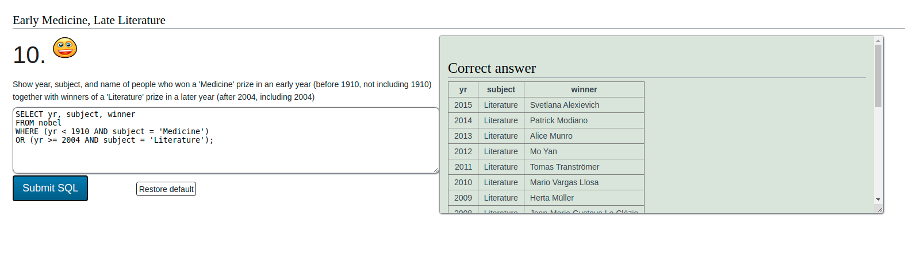
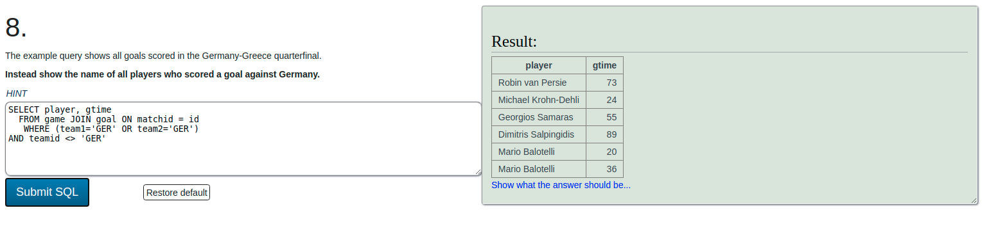

# SQL Zoo

> Lots of practice and all solutions for tutorials and quizes for SQL queries from the websit [SQL Zoo](https://sqlzoo.net/wiki/SELECT_basics)

Additional description about the project and its features.

## Built With

- SQL
- MySQL RDBMS

## Getting Started

To get a local copy up and running follow these simple example steps.

### Prerequisites
A computer connected to the internet. No need to set up locally. You try on the website.

### Usage
Try out the quizes yourself and if you have failed to find the solution, come and check this repo.

Correct answers are displayed with a smilie face

Incorrect answers do not have a smilie face. It means you still have work to do on the solution

## Authors

👤 **Kaboha Jean Mark**

- GitHub: [@KabohaJeanMark](https://github.com/KabohaJeanMark)
- Twitter: [@jean_quintus](https://twitter.com/jean_quintus)
- LinkedIn: [Jean Mark Kaboha](https://www.linkedin.com/in/jean-mark-kaboha-software-engineer/)

## 🤝 Contributing

Contributions, issues, and feature requests are welcome!

Feel free to check the [issues page](https://github.com/KabohaJeanMark/SQL-ZOO/issues).

## Show your support

Give a ⭐️ if you like this project!

## Acknowledgments

- Hat tip to anyone whose code was used
- Inspiration
- etc

## 📝 License

This project is [MIT](./LICENSE) licensed.
